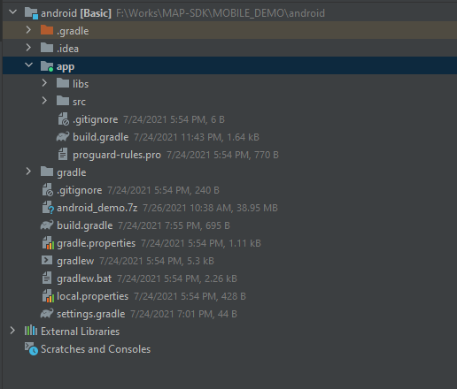

# Cài đặt  Android SDK
Để có thể phát triển ứng dụng của bạn với VietMap SDK thì bạn cần cài đặt dependency của nó
Hãy bật ProGuard cho ứng dụng của bạn nếu bị lỗi vượt quá giới hạn 65k method,
## 1. Thêm dependency
* Mở Android Studio
* Mở file build.gradle của ứng dụng
* Đảm bảo minSdkVersion tối thiểu 14 trở lên
* Thêm các dòng sau vào trong file build.gradle
``` java

dependencies {
    ...
    
    implementation 'com.mapbox.mapboxsdk:mapbox-android-gestures:0.7.0'
    implementation 'org.maplibre.gl:android-sdk-geojson:5.9.0'
    implementation 'org.maplibre.gl:android-sdk-turf:5.9.0'
    implementation 'com.squareup.okhttp3:okhttp:3.12.3'
    implementation files('libs/MapboxGLAndroidSDK.aar')
}
```

Tạo thư mục libs cùng cấp với thư mục scr
Copy "MapboxGLAndroidSDK.aar" vào thư muc libs



Tiến hành sync project

## 2. Cài đặt permissions
Bạn có thể add các quyền sau để thư viện có thể load được dữ liệu:
Nếu bạn muốn có vị trí user thì add quyền ACCESS_FINE_LOCATION
```xml
<uses-permission android:name="android.permission.INTERNET" />
<uses-permission android:name="android.permission.ACCESS_NETWORK_STATE" />
<uses-permission android:name="android.permission.ACCESS_FINE_LOCATION" />
```
## 3. Thêm bản đồ vào màn hình ứng dụng
Ở file xml, khai báo MapView như sau:
```xml
<com.mapbox.mapboxsdk.maps.MapView
  android:id="@+id/mapView"
  android:layout_width="match_parent"
  android:layout_height="match_parent"
  />

```
Trong MainActivity, tiến hành thêm đoạn code sau :

[để lấy tile vietmap vui lòng đọc thêm ở đây ](../vietmap-tile.md)
```java
import androidx.annotation.NonNull;
import androidx.appcompat.app.AppCompatActivity;

import android.os.Bundle;
import com.mapbox.mapboxsdk.Mapbox;
import com.mapbox.mapboxsdk.WellKnownTileServer;
import com.mapbox.mapboxsdk.maps.MapView;
import com.mapbox.mapboxsdk.maps.MapboxMap;
import com.mapbox.mapboxsdk.maps.OnMapReadyCallback;
import com.mapbox.mapboxsdk.maps.Style;
import com.mapbox.mapboxsdk.http.HttpRequest;
public class MainActivity extends AppCompatActivity {
 private MapView mapView = null;
    @Override
    protected void onCreate(Bundle savedInstanceState) {
        super.onCreate(savedInstanceState);

        Mapbox.getInstance(this);
        setContentView(R.layout.activity_main);
        mapView = findViewById(R.id.mapView);
        if(mapView!=null){
            mapView.onCreate(savedInstanceState);
            mapView.getMapAsync(new OnMapReadyCallback() {
                @Override
                public void onMapReady(@NonNull MapboxMap mapboxMap) {
                    String tileUrl="https://maps.vietmap.vn/mt/tm/style.json?apikey={your-api-key}";
                    mapboxMap.setStyle(new Style.Builder().fromUri(tileUrl));
                    mapboxMap.getUiSettings();

                }
            });
        }
        }
}
```
## 4. Quản lý Lifecycle
Lớp MapView có vòng đời của riêng nó để có thể quản lý hiệu quả Android OpenGL và nó cần được gắn chặt với Activity gọi nó. 
Ta cần override lại vòng đời của Activity và thực hiện gọi tương ứng cho MapView
Trong MainActivity, tiến hành thêm đoạn code sau :
```java
 @Override
    protected void onStart() {
        super.onStart();
        if(mapView!=null){
            mapView.onStart();
        }
    }

    @Override
    protected void onResume() {
        super.onResume();
        if(mapView!=null){
            mapView.onResume();
        }
    }

    @Override
    protected void onPause() {
        super.onPause();
        if(mapView!=null){
            mapView.onPause();
        }
    }

    @Override
    protected void onDestroy() {
        super.onDestroy();
        if(mapView!=null){
            mapView.onDestroy();
        }
    }

    @Override
    public void onLowMemory() {
        super.onLowMemory();
        if(mapView!=null){
            mapView.onLowMemory();
        }
    }

    @Override
    protected void onSaveInstanceState(@NonNull Bundle outState) {
        super.onSaveInstanceState(outState);
        if(mapView!=null){
            mapView.onSaveInstanceState(outState);
        }
    }
```

# Tham khảo thêm [Add điểm lên bản đồ](./example/add_marker.md)