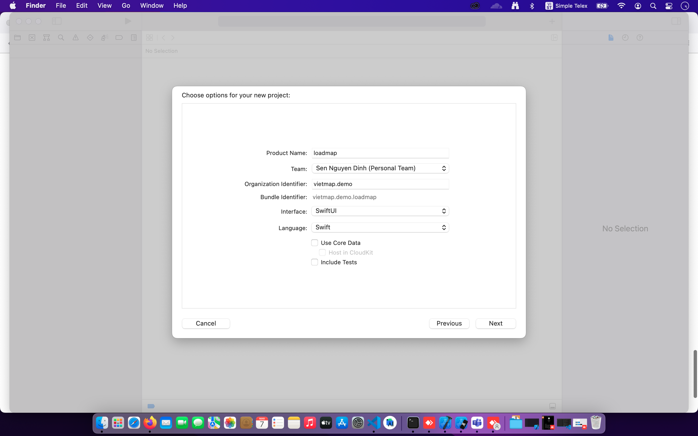
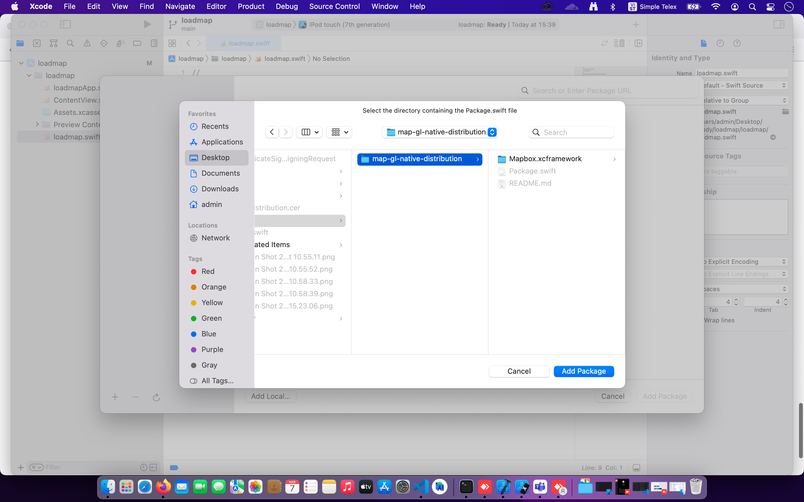
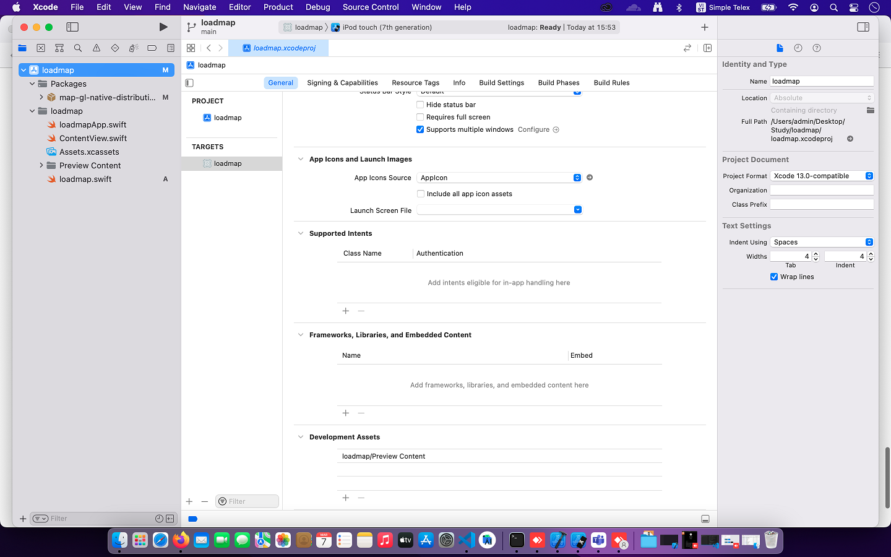
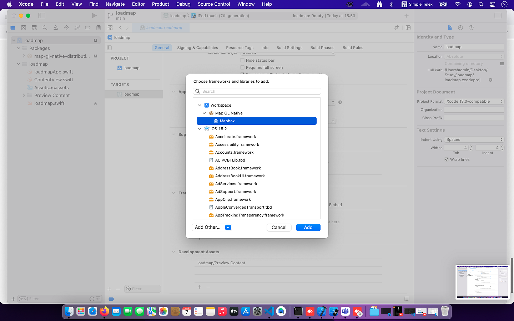
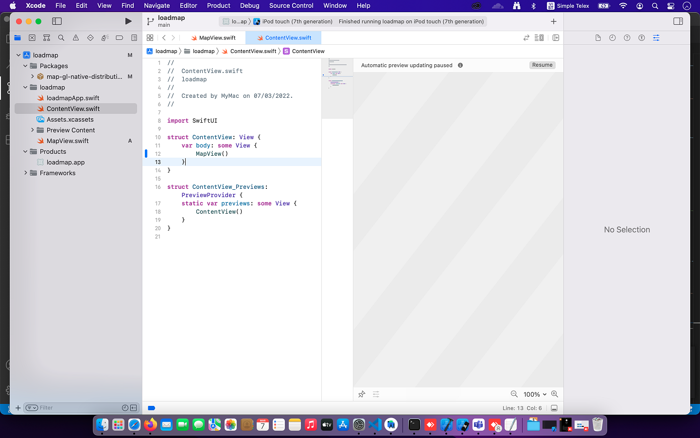
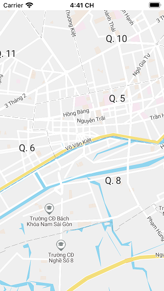

# Cài đặt  IOS SDK
SDK iOS là bộ thư viện cho iOS sử dụng OpenGL để hiển thị bản đồ đồng thời hỗ trợ tìm kiếm địa điểm và chỉ dẫn đường đi.
Nó là một phần của hệ sinh thái VietMap SDK

Là thư viện sử dụng OpenGL để hiển thị bản đồ và xử lý tương tác người dùng với bản đồ
Yêu cầu
* iOS 9.0+
* Xcode 8.0+

Setup project with SwiftUI


## Add Map Native SDK for iOS
* To add a package dependency to your Xcode project, select File > Swift Packages > Add Package Dependency








## Create Map view
** In your project, add new SwiftUI View to the SimpleMap_SwiftUI folder and name it MapView.swift

I** In order to use native UIKit views in SwiftUI view, you must use [UIViewRepresentable](https://developer.apple.com/documentation/swiftui/uiviewrepresentable) wrapper. The instance of custom type which adopts UIViewRepresentable protocol is responsible for creation and management a UIView object in your SwiftUI interface.

```swift
import Foundation
import Mapbox
import MapKit
import SwiftUI

struct MapView: UIViewRepresentable {
    ..
}
```


The UIViewRepresentable requires to implement makeUIViewController(context:) method that creates the instance of with the desired UIKit view. Add the following code to create map view instance

```swift
func makeUIView(context: Context) -> MGLMapView {
        
        
        
        // Build the style url

        let styleURL = URL(string: "https://maps.vietmap.vn/mt/tm/style.json?apikey={your-key}")
        
        // create the mapview
        let mapView = MGLMapView(frame: .zero, styleURL: styleURL)
      
        mapView.logoView.isHidden = true
        mapView.attributionButton.isHidden = true
        //10.763952501882402, 106.67257965619578
        mapView.setCenter(
            CLLocationCoordinate2D(latitude: 10.763952501882402, longitude: 106.67257965619578),
            zoomLevel: 14,
            animated: false)
        
        // use the coordinator only if you need
        // to respond to the map events
        mapView.delegate = context.coordinator
        
        return mapView
    }
    
    func updateUIView(_ uiView: MGLMapView, context: Context) {}
    
    func makeCoordinator() -> MapView.Coordinator {
        Coordinator(self)
    }
    
    final class Coordinator: NSObject, MGLMapViewDelegate {
        var control: MapView
        
        init(_ control: MapView) {
            self.control = control
            
        }

        func mapViewDidFinishLoadingMap(_ mapView: MGLMapView) {
            // write your custom code which will be executed
            // after map has been loaded
        }
    }
```

The UIViewRepresentable view also requires to implement updateUIView(_:context:) which is used to configure the newly created instance. We dont need to configure anything so we will keep it empty.

```swift
 func updateUIView(_ uiView: MGLMapView, context: Context) {}
```
    
## Respond to map events
If order to to respond to map events, for example perform an action after MapView initialization finished. In SwiftUI, a Coordinator can be used with delegates, data sources, and user events. The UIViewRepresentable protocol defines makeCoordinator() method which creates coordinator instance. Add the following code to declare coordinator class:

```swift
class Coordinator: NSObject, MGLMapViewDelegate {
        var control: MapView
        
        init(_ control: MapView) {
            self.control = control
        }

        func mapViewDidFinishLoadingMap(_ mapView: MGLMapView) {
            // write your custom code which will be executed
            // after map has been loaded
        }
    }
```

And then add the following method to the SwiftUI view:

```swift
func makeCoordinator() -> MapView.Coordinator {
        Coordinator(self)
    }
```
And finally set the reference coordinator on mapbox map view

```swift
    mapView.delegate = context.coordinator
```

Update ContenView



And Result:


